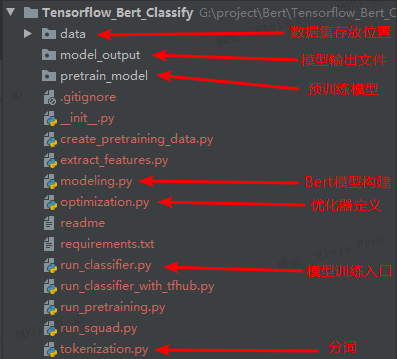

#### 1.项目介绍

​	此项目是一个TensorFlow Bert的情感分析（二分类）项目。工程代码参考 google-research的Bert（https://github.com/google-research/bert）。在该工程上做了如下修改：

​	①对代码进行了中文注释

​	②移除一些不必要的文件

​	③添加中文数据集，对中文数据集进行预处理Process，并在Bert上层构建二分类全连接神经网络


#### 2.工程介绍



​	data：是存放数据集的文件夹，BERT读取数据集默认是tsv文件

​	model_output：是模型训练输出的参数文件

​	pretrain_model：是预训练模型存放位置，这部分模型参数 可选择  Google预训练的BERT-Base, Chinese中文模型 （https://storage.googleapis.com/bert_models/2018_11_03/chinese_L-12_H-768_A-12.zip），若是英文数据集，可以参考 google-research/Bert 列出的其他预训练模型。

​	

#### 3.运行命令

```shell
# 训练启动命令
# python run_classifier.py --task_name=news --do_train=true --do_eval=true --data_dir=data --vocab_file=./pretrain_model/chinese_L-12_H-768_A-12/vocab.txt --bert_config_file=./pretrain_model/chinese_L-12_H-768_A-12/bert_config.json --init_checkpoint=./pretrain_model/chinese_L-12_H-768_A-12/bert_model.ckpt --max_seq_length=300 --train_batch_size=4 --learning_rate=2e-5 --num_train_epochs=3.0 --output_dir=./model_output/

python run_classifier.py
    --task_name=news    # 任务名
    --do_train=true   # 是否训练
    --do_eval=true   # 是否评估
    --data_dir=data   # 数据存放位置
    --vocab_file=./pretrain_model/chinese_L-12_H-768_A-12/vocab.txt  # 词表文件位置
    --bert_config_file=./pretrain_model/chinese_L-12_H-768_A-12/bert_config.json   # bert模型配置参数
    --init_checkpoint=./pretrain_model/chinese_L-12_H-768_A-12/bert_model.ckpt   # 已预训练好的Bert模型参数
    --max_seq_length=300   # 输入最多300个词
    --train_batch_size=4   # batch size
    --learning_rate=2e-5    # 学习率
    --num_train_epochs=3.0    # 训练轮次
    --output_dir=./model_output/   # 模型输出结果
```

